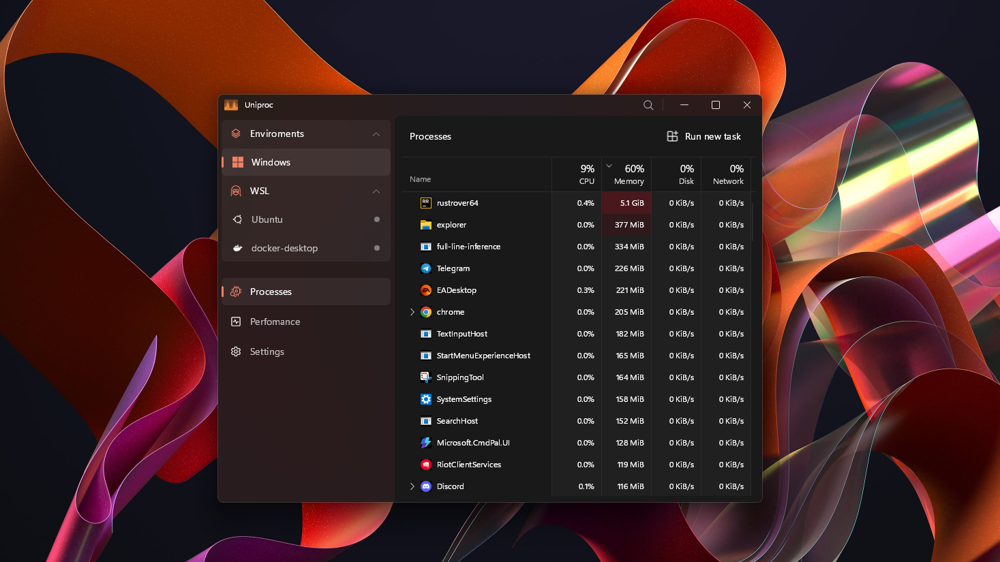

  

  # Uniproc

  **A modern, blazing fast 🚀 system monitor for the Windows 11 & WSL era.**

  
  
  

---

## 📸 Preview

  

  <i>I tried my best to make it look cool :(</i>

## What is it?
**Uniproc** is a modern and fast system monitor for Windows 11 built with **Rust** and **Slint**. It serves as a lightweight alternative to the default Task Manager, providing unified process monitoring across Windows, WSL, and Docker in a single, seamless interface.

## Motivation
The project addresses three main pain points:

*   WSL Transparency: Stop treating WSL as a vmmem "black box." Uniproc lets you see the real-time resource consumption of every individual Linux process — a feature [requested in 2021](https://github.com/microsoft/WSL/issues/6881) that still hasn't been officially resolved.
*  **Performance:** Significantly more responsive with lower CPU and RAM overhead compared to the native Task Manager. 🦀🚀
*   **Aesthetics:** Unlike powerful but visually dated tools like Process Hacker, Uniproc strictly follows Fluent-like design. It provides professional-grade monitoring without the interface "vibes" from the early 2000s.
