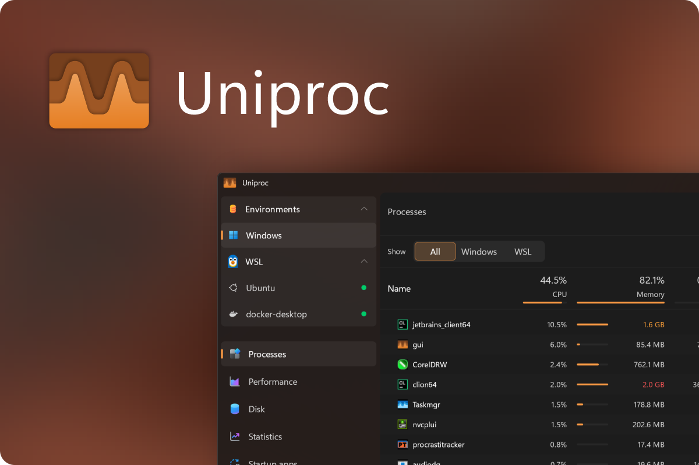

  

**A system monitor for Windows 11 and WSL.**

---

## What is it?

**Uniproc** is a system monitor for Windows 11 built with **Rust** and **WinUI 3**. It shows processes, services and
machine metrics from Windows, WSL and Docker in one place, instead of one tool per environment.

## Motivation

* **WSL transparency.** Stop treating WSL as a `vmmem` black box. Uniproc shows the resource consumption of every
  individual Linux process — [asked for in 2021](https://github.com/microsoft/WSL/issues/6881) and still not resolved
  officially.
* **Appearance.** Tools like Process Hacker are capable but look their age. Uniproc follows Fluent Design, so a
  monitoring tool does not have to feel like it was built in 2003.
